# ArgoCD GitOps Platform Architecture

## Overview

Production-ready per-cluster ArgoCD deployment implementing industry-standard patterns from ArgoCD 3.0+, Kubernetes admission webhook optimization, and GKE integration. Each GKE cluster runs its own ArgoCD instance for complete isolation, simplified configuration, and independent operations.

## Architecture Principles

### Industry Standards
- **3-Level Architecture**: Kubernetes Manifests → ApplicationSets → App-of-Apps
- **ApplicationSet-First**: Prefer ApplicationSets over individual Applications
- **Go Template Support**: Modern templating for configuration management
- **Admission Webhook Optimization**: Resource allocation for webhook stability (2GiB minimum memory)
- **Chart.yaml Wrappers**: External chart dependencies with direct values structure

### Per-Cluster Design Benefits
- **Complete Isolation**: Each cluster's ArgoCD instance manages only local resources
- **Security**: No cross-cluster access or credentials sharing
- **Operational Simplicity**: Independent cluster lifecycle management
- **Performance Optimization**: Dedicated resources per cluster workload
- **Clear Ownership**: Single source of truth per cluster

## Architecture Diagram

### Per-Cluster Model


## Directory Structure

```
gke-argocd-cluster-gitops-poc/
├── infrastructure/                      # Level 1: Kubernetes Manifests
│   ├── services/                       # Infrastructure services
│   │   ├── cert-manager/               # Chart.yaml + values hierarchy
│   │   ├── external-dns/               # Chart.yaml + values hierarchy  
│   │   ├── external-secrets/           # Chart.yaml + values hierarchy
│   │   ├── github-arc-runner/          # GitHub Actions runners
│   │   └── ingress-nginx/              # Chart.yaml + values hierarchy (2GiB memory)
│   ├── monitoring/                     # Monitoring stack
│   │   ├── prometheus-stack/           # Chart.yaml + values hierarchy
│   │   └── karma/                      # Alert dashboard
│   └── ApplicationSets/                # Level 2: ApplicationSet definitions
│       ├── services.yaml              # Infrastructure ApplicationSet
│       └── monitoring.yaml            # Monitoring ApplicationSet
├── applications/                       # Business applications
│   ├── backend/                       # Backend services
│   │   └── api-service/               # Backend API service
│   └── ApplicationSets/               # Business ApplicationSets
│       └── backend.yaml               # Backend applications ApplicationSet
├── clusters/                          # 3-Tier configuration hierarchy
│   ├── development/
│   │   ├── values/                    # Environment-wide defaults (NEW)
│   │   │   ├── ingress-nginx.yaml    # Shared dev settings (50% resources)
│   │   │   ├── cert-manager.yaml     # Dev cert configuration
│   │   │   └── prometheus-stack.yaml # Reduced monitoring resources
│   │   ├── dev-cluster-01/    # Cluster-specific
│   │   │   └── values/               # Only unique overrides
│   │   │       └── ingress-nginx.yaml # Domain names only
│   │   └── dev-cluster-02/    
│   │       └── values/               
│   ├── staging/
│   │   ├── values/                   # Staging environment defaults
│   │   └── staging-01-ue1-cluster-01/
│   └── production/
│       ├── values/                   # Production environment defaults
│       └── prod-cluster-01/
├── bootstrap/                         # Level 3: ArgoCD bootstrap (App-of-Apps)
│   ├── argocd-self.yaml             # ArgoCD self-management ApplicationSet
│   ├── system.yaml                   # ArgoCD system components
│   ├── infrastructure-apps.yaml      # Infrastructure ApplicationSets
│   ├── applications.yaml             # Business applications
│   ├── dynamic-overlays.yaml         # Dynamic overlay discovery
│   ├── argocd-health-check.yaml      # ArgoCD health validation
│   ├── argocd-projects/             # Project definitions
│   │   ├── system-project.yaml
│   │   ├── infrastructure-project.yaml
│   │   ├── monitoring-project.yaml
│   │   ├── applications-project.yaml
│   │   └── github-arc-project.yaml
│   └── argocd-rbac/                 # RBAC configurations
├── terraform/modules/argocd/          # Simplified Terraform module
│   ├── main.tf                       # Simplified deployment logic
│   ├── variables.tf                  # Single-model variables
│   ├── outputs.tf                    # Essential outputs only
│   └── values/                       # Terraform-generated values
│       ├── base-values.yaml.tpl     # Base ArgoCD configuration
│       └── resource-values.yaml.tpl  # Resource allocation templates
├── scripts/                          # Streamlined operational scripts
│   ├── bootstrap.sh                  # Single cluster bootstrap
│   ├── fleet-status.sh              # Fleet monitoring
│   └── validate.sh                  # Comprehensive validation
└── docs/                             # Consolidated documentation
    ├── ARCHITECTURE.md              # This file
    ├── RUNBOOK.md                   # Operations procedures
    └── SECURITY.md                  # Security guidelines
```

## Metadata-Driven Configuration Architecture

### Overview
The platform implements a sophisticated metadata-driven architecture that enables:
- **Dynamic Branch-Based Deployment**: Each cluster can track different Git branches
- **3-Tier Configuration Hierarchy**: Base → Environment → Cluster inheritance

### Cluster Metadata System

Every cluster has metadata labels that control its behavior:

```yaml
# Set by Terraform during cluster creation
metadata:
  labels:
    argocd.argoproj.io/secret-type: cluster      # Required for discovery
    cluster-name: dev-cluster-01           # Unique cluster identifier
    environment: development                       # Environment (dev/staging/prod)
    env-type: non-prod                            # Environment type for value selection
    env-values-path: clusters/development/values  # Path to environment values
    cluster-values-path: clusters/development/dev-cluster-01/values
    target-revision: main                         # Git branch/tag to track
```

### Matrix Generator Pattern

All ApplicationSets use matrix generators to combine their logic with cluster metadata:

```yaml
spec:
  generators:
  - matrix:
      generators:
      - list:           # or git/scm
          elements: [...]
      - clusters:       # Provides cluster metadata
          selector:
            matchLabels:
              argocd.argoproj.io/secret-type: cluster
```

This pattern enables:
- **Dynamic targetRevision**: `{{index .metadata.labels "target-revision" | default "main"}}`
- **Dynamic paths**: Construct value file paths from cluster labels
- **Per-cluster behavior**: Different configurations per cluster

### 3-Tier Configuration Hierarchy

Configuration follows a clear inheritance model:

```
┌─────────────────────────────────────────────┐
│ Level 3: Cluster-Specific                   │
│ clusters/{env}/{cluster}/values/            │
│ (10-20% unique settings)                    │
├─────────────────────────────────────────────┤
│ Level 2: Environment-Wide                   │
│ clusters/{env}/values/                      │
│ (60-80% shared settings)                    │
├─────────────────────────────────────────────┤
│ Level 1: Base Service Defaults              │
│ {service}/values.yaml                       │
│ (vendor defaults + org standards)           │
└─────────────────────────────────────────────┘
```

Example value resolution:
```yaml
helm:
  valueFiles:
  - 'values.yaml'                                    # Base defaults
  - 'values-{{.env-type}}.yaml'                    # Environment type
  - '../../../{{.env-values-path}}/{{.name}}.yaml' # Environment level
  - '../../../{{.cluster-values-path}}/{{.name}}.yaml' # Cluster level
  ignoreMissingValueFiles: true
```

### Dynamic Overlays

The `dynamic-overlays.yaml` ApplicationSet automatically discovers and deploys Kustomize overlays:

```yaml
apiVersion: argoproj.io/v1alpha1
kind: ApplicationSet
metadata:
  name: dynamic-overlays
spec:
  generators:
  - matrix:
      generators:
      - git:  # Discovers overlay-config.yaml files
          files:
          - path: "clusters/*/overlays/*/overlay-config.yaml"
          - path: "clusters/*/*/overlays/*/overlay-config.yaml"
      - clusters:  # Adds cluster metadata
```

This enables:
- **Automatic discovery**: No manual Application creation
- **Environment overlays**: Shared across clusters in an environment
- **Cluster overlays**: Specific to individual clusters
- **Dynamic revision**: Each overlay tracks the cluster's branch

## Core Components

### 1. Infrastructure Services (Level 1)
**Location**: `infrastructure/services/`

Each service uses a Chart.yaml wrapper pattern with external Helm chart dependencies:

```yaml
# Example: infrastructure/services/ingress-nginx/Chart.yaml
apiVersion: v2
name: ingress-nginx
type: application
version: 0.1.0
dependencies:
  - name: ingress-nginx
    version: "4.8.0"
    repository: https://kubernetes.github.io/ingress-nginx
```

**Resource Allocation**:
- **NGINX Ingress**: Minimum 2GiB memory, 1000m CPU for admission webhook stability
- **Development**: 50% resource reduction for cost optimization
- **Production**: Enhanced resources with HPA and anti-affinity rules

### 2. ApplicationSets (Level 2)
**Location**: `infrastructure/ApplicationSets/`, `applications/ApplicationSets/`, `bootstrap/`

**Matrix Generator Coverage** - All ApplicationSets use matrix generators:

**Bootstrap ApplicationSets** (converted from Applications):
- **system.yaml**: Matrix (list + cluster) - Creates AppProjects and RBAC
- **infrastructure-apps.yaml**: Matrix (list + cluster) - Deploys infrastructure ApplicationSets
- **applications.yaml**: Matrix (list + cluster) - Deploys application ApplicationSets
- **argocd-self.yaml**: Matrix (list + cluster) - ArgoCD self-management
- **dynamic-overlays.yaml**: Matrix (git + cluster) - Discovers overlay configurations

**Infrastructure ApplicationSets**:
- **services.yaml**: Matrix (list + cluster) - Infrastructure services
- **monitoring.yaml**: Matrix (list + cluster) - Prometheus stack
- **github-arc.yaml**: Matrix (list + cluster) - GitHub runners
- **external-secrets-config.yaml**: Uses cluster generator directly

**Application ApplicationSets**:
- **analytics.yaml**: Matrix (git + cluster) - Analytics applications
- **backend.yaml**: Matrix (git + cluster) - Backend services

**Universal Features**:
- Dynamic targetRevision: `{{index .metadata.labels "target-revision" | default "main"}}`
- Dynamic value paths from cluster metadata
- Branch-based deployment support
- Environment-aware configuration
- 3-tier value file hierarchy with environment inheritance
- Git directory generators for automatic discovery
- Go templates for dynamic path construction

### 3. Bootstrap System (Level 3 - App-of-Apps)
**Location**: `bootstrap/`

**Terraform-Managed Root Application** with dynamic revision:

```yaml
# Created by Terraform with variable substitution
apiVersion: argoproj.io/v1alpha1
kind: Application
metadata:
  name: cluster-bootstrap
spec:
  source:
    repoURL: ${var.bootstrap_repo_url}
    targetRevision: ${var.bootstrap_repo_revision}  # Dynamic branch/tag
    path: bootstrap
  destination:
    namespace: argocd
  syncPolicy:
    automated:
      prune: true
      selfHeal: true
```

**Bootstrap Components**:
- `system.yaml` - Creates AppProjects and RBAC
- `infrastructure-apps.yaml` - Deploys infrastructure ApplicationSets
- `applications.yaml` - Deploys application ApplicationSets
- `argocd-self.yaml` - ArgoCD self-management
- `dynamic-overlays.yaml` - Discovers and deploys overlays

### 4. Cluster Configuration (3-Tier Hierarchy)
**Location**: `clusters/{environment}/` and `clusters/{environment}/{cluster-name}/`

**3-Tier Configuration Hierarchy**:
1. **Base Values**: Service defaults in `{service}/values.yaml`
2. **Environment Values**: Shared settings in `clusters/{environment}/values/`
3. **Cluster Values**: Specific overrides in `clusters/{environment}/{cluster-name}/values/`

```yaml
# Environment-wide (clusters/development/values/ingress-nginx.yaml)
controller:
  resources:
    limits:
      cpu: 500m        # Reduced for all dev clusters
      memory: 1Gi      # 50% of production
    requests:
      cpu: 100m
      memory: 256Mi

# Cluster-specific (clusters/development/dev-cluster-01/values/ingress-nginx.yaml)
controller:
  service:
    annotations:
      service.beta.kubernetes.io/azure-load-balancer-resource-group: "dev-01-rg"  # Only cluster-specific
```

## Configuration Metadata Architecture

### Metadata-Driven Dynamic Behavior

The platform uses cluster metadata labels to enable dynamic configuration management:

**Cluster Metadata Labels** (Set by Terraform):
```hcl
labels = {
  "argocd.argoproj.io/secret-type" = "cluster"
  "cluster-name"       = var.cluster_name
  "environment"        = var.gcp_folder
  "env-type"           = var.gcp_folder == "production" ? "prod" : "non-prod"
  "env-values-path"    = "clusters/${var.gcp_folder}/values"
  "cluster-values-path" = "clusters/${var.gcp_folder}/${var.cluster_name}/values"
  "target-revision"    = var.bootstrap_repo_revision
}
```

### Matrix Generator Pattern

All ApplicationSets use matrix generators to access cluster metadata:

```yaml
generators:
- matrix:
    generators:
    - list:  # Services or components
        elements:
        - name: ingress-nginx
    - clusters:  # Cluster metadata
        selector:
          matchLabels:
            argocd.argoproj.io/secret-type: cluster
```

### Dynamic Value Resolution

ApplicationSets construct paths dynamically using cluster labels:

```yaml
helm:
  valueFiles:
  - 'values.yaml'                                                              # Base
  - 'values-{{index .metadata.labels "env-type"}}.yaml'                      # Type
  - '../../../{{index .metadata.labels "env-values-path"}}/{{.name}}.yaml'   # Environment
  - '../../../{{index .metadata.labels "cluster-values-path"}}/{{.name}}.yaml' # Cluster
  ignoreMissingValueFiles: true
```

### Branch-Based Deployment

Every ApplicationSet supports dynamic targetRevision:

```yaml
source:
  targetRevision: '{{index .metadata.labels "target-revision" | default "main"}}'
```

This enables:
- Testing feature branches on specific clusters
- Gradual rollout across environments
- Easy rollback by changing cluster label

## Operational Efficiency

### Deployment Process
1. **Terraform Module**: Deploys ArgoCD 3.0+ with optimized resource allocation
2. **Bootstrap Application**: Deployed automatically by Terraform
3. **ApplicationSet Processing**: Discovers and deploys infrastructure services
4. **Cluster-Specific Values**: Override base configurations per cluster
5. **Monitoring**: Prometheus/Grafana stack deployed via ApplicationSet

### Key Operations
```bash
# Deploy new cluster
./scripts/bootstrap.sh --cluster dev-cluster-02 --env development

# Monitor fleet health
./scripts/fleet-status.sh --detailed

# Validate architecture compliance
./scripts/validate.sh
```

## Best Practices Integration

### Admission Webhook Stability
- **Memory Allocation**: 2GiB minimum prevents OOMKill and EOF webhook failures
- **CPU Allocation**: 1000m minimum for stable admission processing
- **High Availability**: Pod anti-affinity and graceful shutdown procedures

### Performance Optimizations
- **ApplicationSet Efficiency**: Go templates and simplified path resolution
- **Resource Allocation**: Environment-specific optimization (development 50% reduction)
- **Template Processing**: Faster ApplicationSet rendering
- **Git Operations**: Reduction in repository navigation complexity

### Security by Design
- **Pod Security Standards**: Restricted enforcement on ArgoCD namespace
- **Workload Identity**: GKE-native service account integration
- **OAuth Integration**: 95% automated Google OAuth 2.0 setup
- **RBAC**: Fine-grained role-based access control

## Ingress Architecture

### NGINX Ingress Controller Pattern
All platform services use a unified ingress architecture for consistent access and security:

```mermaid
graph TD
    %% Styling
    classDef internet fill:#e3f2fd,stroke:#0d47a1,stroke-width:3px
    classDef loadbalancer fill:#f3e5f5,stroke:#4a148c,stroke-width:3px
    classDef controller fill:#c8e6c9,stroke:#1b5e20,stroke-width:3px
    classDef service fill:#fff3e0,stroke:#e65100,stroke-width:2px
    classDef feature fill:#fce4ec,stroke:#880e4f,stroke-width:1px

    %% Network Flow
    Internet["🌐 Internet"]:::internet
    
    ExternalIP["External IP<br/>STATIC-IP-1"]:::loadbalancer
    
    NginxLB["nginx-ingress<br/>LoadBalancer<br/>Service"]:::loadbalancer
    
    subgraph IngressController["nginx-ingress-controller"]
        TLS["TLS termination"]
        Routing["Path-based routing"]
        Certs["Certificate management"]
    end
    
    %% Services
    ArgoCD["ArgoCD<br/>Service<br/>(ClusterIP)"]:::service
    Grafana["Grafana<br/>Service<br/>(ClusterIP)"]:::service
    Karma["Karma<br/>Service<br/>(ClusterIP)"]:::service
    BackendAPI["Backend API<br/>Service<br/>(ClusterIP)"]:::service
    
    %% Connections
    Internet --> ExternalIP
    ExternalIP --> NginxLB
    NginxLB --> IngressController
    IngressController --> ArgoCD
    IngressController --> Grafana
    IngressController --> Karma
    IngressController --> BackendAPI
    
    %% Apply styles
    class IngressController controller
    class TLS,Routing,Certs feature
```



### Ingress Configuration Standards

#### Development Environment
- **Domain Pattern**: `{service}-dev.2269aa47.sslip.io`
- **TLS**: Let's Encrypt staging certificates via cert-manager
- **Examples**:
  - ArgoCD: `https://argo-dev.2269aa47.sslip.io`
  - Grafana: `https://grafana-dev.2269aa47.sslip.io`
  - Karma: `https://karma-dev.2269aa47.sslip.io`
  - Backend API: `https://api-dev.2269aa47.sslip.io`

#### Production Environment
- **Domain Pattern**: `{service}.{environment}.{company-domain}.com`
- **TLS**: Let's Encrypt certificates via cert-manager
- **High Availability**: Multiple ingress controller replicas

### Certificate Management

```yaml
# Self-signed ClusterIssuer for development
apiVersion: cert-manager.io/v1
kind: ClusterIssuer
metadata:
  name: selfsigned-issuer
spec:
  selfSigned: {}

# Service ingress annotation
annotations:
  cert-manager.io/cluster-issuer: "selfsigned-issuer"
```

### Ingress Benefits
- **Cost Efficiency**: Single LoadBalancer for all services
- **Unified Access**: Consistent URL patterns across services
- **Security**: Centralized TLS termination and policies
- **Flexibility**: Easy addition of new services
- **Monitoring**: Single point for access logs and metrics

## Branch-Based Deployment Operations

### Deployment Scenarios

#### 1. Deploy New Cluster with Feature Branch
```bash
# Deploy cluster tracking a specific branch
terraform apply \
  -var="cluster_name=dev-cluster-02" \
  -var="bootstrap_repo_revision=feature/new-service"
```

#### 2. Change Existing Cluster's Branch
```bash
# Update cluster to track different branch
kubectl label secret in-cluster -n argocd \
  target-revision=develop --overwrite

# Force sync to pick up changes
kubectl annotate applicationset --all -n argocd \
  argocd.argoproj.io/refresh=true --overwrite
```

#### 3. Gradual Rollout Pattern
```bash
# Test on dev cluster
kubectl label secret in-cluster -n argocd \
  target-revision=feature/xyz --overwrite

# Promote to staging
kubectl label secret in-cluster -n argocd \
  target-revision=feature/xyz --overwrite \
  --context=staging-cluster

# Finally to production
kubectl label secret in-cluster -n argocd \
  target-revision=main --overwrite \
  --context=prod-cluster
```

### Verification Commands
```bash
# Check current branch for all ApplicationSets
kubectl get applicationsets -n argocd -o custom-columns=\
NAME:.metadata.name,\
REVISION:.spec.template.spec.source.targetRevision

# Verify cluster metadata
kubectl get secret in-cluster -n argocd -o yaml | \
  grep -A10 labels:

# Run comprehensive verification
./scripts/verify-dynamic-revision.sh
```

## Architecture Benefits

### Immediate Benefits
- ✅ **Configuration Reduction**: Environment-level sharing eliminates duplication
- ✅ **Dynamic Revision Coverage**: All ApplicationSets support branch-based deployment
- ✅ **3-Tier Configuration Hierarchy**: Clear precedence and inheritance

### Operational Efficiency
- ✅ **Simplified Troubleshooting**: Clear ownership and standard procedures
- ✅ **Self-Healing Applications**: Automated recovery with retry policies
- ✅ **Team Productivity**: Faster onboarding with simplified architecture

### Long-term Value
- ✅ **Industry Standards**: Aligned with ArgoCD best practices
- ✅ **Scalability**: Optimized for growth without complexity accumulation
- ✅ **Maintainability**: Reduction in ongoing maintenance overhead
- ✅ **Performance**: Resource utilization and response times
