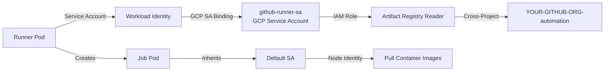

# ArgoCD Bootstrap Hierarchy and Configuration System

## Table of Contents
1. [Overview](#overview)
2. [Bootstrap Hierarchy](#bootstrap-hierarchy)
3. [Resource Creation Sequence](#resource-creation-sequence)
4. [Configuration Overlay System](#configuration-overlay-system)
5. [Platform Access](#platform-access)
6. [Key Architectural Decisions](#key-architectural-decisions)
7. [Monitoring Integration](#monitoring-integration)
8. [Practical Examples](#practical-examples)
9. [Troubleshooting](#troubleshooting)
10. [Recent Changes](#recent-changes)

## Overview

This document provides a comprehensive analysis of the ArgoCD bootstrap hierarchy and configuration management system for the GKE GitOps platform. Using ULTRATHINK methodology, it details how resources are created, managed, and configured across different environments.

### Key Concepts
- **Bootstrap Hierarchy**: The dependency chain from Terraform to individual applications
- **ApplicationSets**: Templated application generation based on Git structure
- **Matrix Generators**: All ApplicationSets use matrix generators for metadata access
- **Configuration Overlays**: Multi-level value file inheritance for environment customization
- **AppProject Isolation**: Security boundaries between different application types
- **Dynamic Revision**: ApplicationSets support branch-based deployment
- **Metadata-Driven**: Cluster labels control all dynamic behavior
- **Enhanced Monitoring**: Slack integration with dynamic alert templates
- **3-Tier Config**: Complete implementation across all environments

## Bootstrap Hierarchy

### ArgoCD Architecture Diagram

```mermaid
---
config:
  theme: redux-dark
  look: neo
  layout: dagre
---
flowchart TD
    A["Terraform Module"] -- Creates --> B["Helm Release: ArgoCD"]
    A -- kubectl apply --> C["Application: cluster-bootstrap"]
    A -- Creates --> CM["ConfigMap: argocd-cluster-config<br/>Labels: cluster-name, environment, target-revision"]
    A -- Creates --> CS["Secret: in-cluster<br/>Labels: cluster metadata"]
    C -- Points to bootstrap/ --> D["Bootstrap Directory Resources"]
    D --> E["ApplicationSet: system.yaml<br/>(Matrix: List + Cluster)"] & F["ApplicationSet: infrastructure-apps.yaml<br/>(Matrix: List + Cluster)"] & G["ApplicationSet: applications.yaml<br/>(Matrix: List + Cluster)"] & H2["ApplicationSet: argocd-self.yaml<br/>(Matrix: List + Cluster)"] & DO["ApplicationSet: dynamic-overlays.yaml<br/>(Matrix: Git + Cluster)"]
    E -- Generates --> H["Application: system-projects"] & I["Application: system-rbac"]
    H -- Creates --> J["AppProjects"]
    J --> J1["AppProject: system"] & J2["AppProject: infrastructure"] & J3["AppProject: monitoring"] & J4["AppProject: applications"] & J5["AppProject: github-arc"]
    F -- Points to --> K["infrastructure/ApplicationSets/"]
    K -- Contains --> L["ApplicationSet: services.yaml"] & M["ApplicationSet: monitoring.yaml"] & N["ApplicationSet: github-arc.yaml"] & T["Application: cert-manager-resources-app.yaml"] & ES["ApplicationSet: external-secrets-config.yaml"]
    L -- "Matrix Generator<br/>Cluster + Service" --> O["Infrastructure Services"]
    O --> O1["Application: cert-manager"] & O2["Application: external-dns"] & O3["Application: external-secrets"] & O4["Application: ingress-nginx"]
    M -- "Matrix Generator<br/>Cluster + Monitoring" --> P["Monitoring Stack"]
    P --> P1["Application: prometheus-stack<br/>(Prometheus + Grafana + Alertmanager)"] & P2["Application: karma<br/>(Alert Dashboard)"]
    N -- "Matrix Generator<br/>Cluster + ARC" --> Q["GitHub Actions Runner Infrastructure"]
    Q --> Q1["Application: github-arc-controller"] & Q2["Application: github-arc-runner-YOUR-GITHUB-ORG"]
    T -- Creates --> U["Cert-Manager Resources"]
    U --> U1["ClusterIssuer: self-signed-issuer"] & U2["ClusterIssuer: letsencrypt-staging"] & U3["ClusterIssuer: letsencrypt-prod"]
    ES -- "Dynamic Path<br/>Per Cluster" --> ESC["External Secrets Config"]
    ESC --> CSS["ClusterSecretStore: google-secret-manager"] & EXS["ExternalSecrets<br/>(5 resources)"]
    CSS -- "Google Secret Manager" --> GSM["GSM Secrets<br/>gke-* prefixed"]
    G -- Points to --> R["applications/ApplicationSets/"]
    R -- Contains --> S["ApplicationSet: analytics.yaml"] & T2["ApplicationSet: backend.yaml"]
    S -- "Git Generator scans" --> V1["applications/analytics/*"]
    V1 -- Generates --> W1["Analytics Applications"]
    W1 --> W1a["Application: analytics-data-processor"]
    T2 -- "Git Generator scans" --> V2["applications/backend/*"]
    V2 -- Generates --> W2["Backend Applications"]
    W2 --> W2a["Application: backend-api-service<br/>(nginx Chart wrapper)"]
    O4 --> X["Ingress Controller"]
    X --> X1["Ingresses"]
    X1 --> X1a["ArgoCD: argo-dev.2269aa47.sslip.io"] & X1b["Grafana: grafana-dev.2269aa47.sslip.io"] & X1c["Karma: karma-dev.2269aa47.sslip.io"] & X1d["Backend API: api-dev.2269aa47.sslip.io"]
    Q1 -- Manages --> Y["ARC Controller"]
    Y -- Controls --> Z["Runner Scale Sets"]
    Q2 -- Creates --> AA["GitHub Runners"]
    AA --> AA1["Runner Pods with PVC"] & AA2["Workflow Job Pods"] & AA3["ConfigMap: Pod Template"]
    AA1 -- "Kubernetes Mode" --> AA4["Persistent Storage Sharing"]
    AA3 -- Defines --> AA5["Job Container Resources"]
    AA -- "Workload Identity" --> AB["GCP Service Account"]
    AB -- "Cross-Project Access" --> AB1["Artifact Registry Reader"]
    H2 -- "Matrix Generator<br/>Self-Management" --> AC["Application: argocd-self-management"]
    AC -- "Helm Values Hierarchy<br/>3-Tier: Base → Env → Cluster" --> AD["ArgoCD Components<br/>OAuth Configured"]
    DO -- "Git + Cluster<br/>Matrix Generator" --> DOV["Dynamic Overlays<br/>Per App/Cluster"]
    DOV --> DOV1["Kustomize Overlays"] & DOV2["Environment Overrides"] & DOV3["Cluster Patches"]
    EXS -- "Creates K8s Secrets" --> ADS["Platform Secrets<br/>(OAuth, PAT, Webhooks)"]
     A:::terraform
     B:::terraform
     C:::terraform
     CM:::terraform
     CS:::terraform
     D:::bootstrap
     E:::bootstrap
     F:::bootstrap
     G:::bootstrap
     H2:::bootstrap
     DO:::bootstrap
     H:::system
     I:::system
     J:::system
     J1:::project
     J2:::project
     J3:::project
     J4:::project
     J5:::project
     K:::infra
     L:::infra
     M:::infra
     N:::infra
     T:::infra
     ES:::infra
     O:::services
     O1:::service
     O2:::service
     O3:::service
     O4:::service
     P:::monitoring
     P1:::monitoringApp
     P2:::monitoringApp
     Q:::arc
     Q1:::arcApp
     Q2:::arcApp
     U:::certResources
     U1:::certResource
     U2:::certResource
     U3:::certResource
     ESC:::secrets
     CSS:::secrets
     EXS:::secrets
     GSM:::external
     R:::apps
     S:::apps
     T2:::apps
     V1:::appPath
     W1:::appGroup
     W1a:::app
     V2:::appPath
     W2:::appGroup
     W2a:::app
     X:::ingress
     X1:::ingress
     X1a:::endpoint
     X1b:::endpoint
     X1c:::endpoint
     X1d:::endpoint
     Y:::arcDetail
     Z:::arcDetail
     AA:::arcDetail
     AA1:::runner
     AA2:::runner
     AA3:::runner
     AA4:::storage
     AA5:::runner
     AB:::gcp
     AB1:::gcpRole
     AC:::selfManage
     AD:::selfManage
     ADS:::secret
    classDef terraform fill:#4B8BF5,stroke:#2563EB,color:#fff
    classDef bootstrap fill:#8B5CF6,stroke:#7C3AED,color:#fff
    classDef system fill:#10B981,stroke:#059669,color:#fff
    classDef project fill:#34D399,stroke:#10B981,color:#000
    classDef infra fill:#F97316,stroke:#EA580C,color:#fff
    classDef services fill:#FCD34D,stroke:#F59E0B,color:#000
    classDef service fill:#FEF3C7,stroke:#FCD34D,color:#000
    classDef monitoring fill:#06B6D4,stroke:#0891B2,color:#fff
    classDef monitoringApp fill:#67E8F9,stroke:#06B6D4,color:#000
    classDef arc fill:#EC4899,stroke:#DB2777,color:#fff
    classDef arcApp fill:#F9A8D4,stroke:#EC4899,color:#000
    classDef certResources fill:#14B8A6,stroke:#0D9488,color:#fff
    classDef certResource fill:#5EEAD4,stroke:#14B8A6,color:#000
    classDef apps fill:#EF4444,stroke:#DC2626,color:#fff
    classDef appPath fill:#FCA5A5,stroke:#EF4444,color:#000
    classDef appGroup fill:#F87171,stroke:#EF4444,color:#000
    classDef app fill:#FEE2E2,stroke:#FCA5A5,color:#000
    classDef ingress fill:#84CC16,stroke:#65A30D,color:#fff
    classDef endpoint fill:#BEF264,stroke:#84CC16,color:#000
    classDef arcDetail fill:#BE185D,stroke:#9D174D,color:#fff
    classDef runner fill:#FDF2F8,stroke:#EC4899,color:#000
    classDef storage fill:#E0E7FF,stroke:#818CF8,color:#000
    classDef gcp fill:#92400E,stroke:#78350F,color:#fff
    classDef gcpRole fill:#FED7AA,stroke:#FB923C,color:#000
    classDef selfManage fill:#1E3A8A,stroke:#1E40AF,color:#fff
    classDef secrets fill:#7C2D12,stroke:#9A3412,color:#fff
    classDef secret fill:#FED7AA,stroke:#FB923C,color:#000
    classDef external fill:#4C1D95,stroke:#5B21B6,color:#fff
    classDef cluster fill:#065F46,stroke:#047857,color:#fff
```



### Directory Structure

```
gke-argocd-cluster-gitops-poc/
├── bootstrap/                        # Entry point for GitOps
│   ├── system.yaml                  # System ApplicationSet (projects, RBAC)
│   ├── infrastructure-apps.yaml     # Infrastructure ApplicationSet
│   ├── applications.yaml            # Business apps ApplicationSet
│   ├── argocd-self.yaml            # ArgoCD self-management ApplicationSet
│   ├── dynamic-overlays.yaml        # Dynamic overlay discovery ApplicationSet
│   ├── argocd-health-check.yaml     # ArgoCD health validation job
│   └── argocd-projects/            # AppProject definitions
│       ├── system-project.yaml
│       ├── infrastructure-project.yaml
│       ├── monitoring-project.yaml
│       ├── applications-project.yaml
│       └── github-arc-project.yaml  # GitHub ARC isolation
├── infrastructure/
│   ├── ApplicationSets/
│   │   ├── services.yaml           # Infrastructure services
│   │   ├── monitoring.yaml         # Monitoring stack
│   │   ├── github-arc.yaml         # GitHub Actions Runner infrastructure
│   │   └── cert-manager-resources-app.yaml  # Cert-manager resources (Application)
│   ├── services/                   # Service configurations
│   │   ├── cert-manager/
│   │   ├── external-dns/
│   │   ├── external-secrets/
│   │   ├── ingress-nginx/
│   │   ├── github-arc-controller/  # ARC controller (v0.12.1)
│   │   └── github-arc-runner/      # GitHub runners with PVC
│   ├── monitoring/                 # Monitoring configurations
│   │   └── prometheus-stack/
│   └── cert-manager-resources/     # Certificate issuers & resources
│       ├── self-signed-issuer.yaml
│       └── kustomization.yaml
├── applications/
│   ├── ApplicationSets/
│   │   ├── analytics.yaml          # Analytics app discovery
│   │   └── backend.yaml            # Backend app discovery
│   ├── analytics/                  # Analytics applications
│   │   └── data-processor/
│   └── backend/                    # Backend applications
│       └── api-service/
└── clusters/                       # Cluster-specific values
    └── development/
        └── dev-cluster-01/
            └── values/
                ├── cert-manager.yaml
                ├── external-dns.yaml
                ├── ingress-nginx.yaml    # With metrics enabled
                ├── argocd.yaml          # HTTPS ingress config
                ├── prometheus-stack.yaml # HTTPS ingress config
                ├── github-arc-controller.yaml # ARC controller config
                └── github-arc-runners.yaml    # Runner scaling & labels
```

## Resource Creation Sequence

### Phase 1: Terraform Initialization

```hcl
# terraform/modules/argocd/main.tf
resource "helm_release" "argocd" {
  name       = "argocd"
  namespace  = "argocd"
  chart      = "argo-cd"
  version    = var.argocd_helm_version
}

resource "time_sleep" "wait_for_crds" {
  depends_on      = [helm_release.argocd]
  create_duration = "30s"
}

resource "null_resource" "bootstrap_application" {
  depends_on = [time_sleep.wait_for_crds]
  
  provisioner "local-exec" {
    command = <<-EOT
      kubectl apply -f - <<EOF
apiVersion: argoproj.io/v1alpha1
kind: ApplicationSet
metadata:
  name: cluster-bootstrap
  namespace: ${var.namespace_name}
# ... (generates cluster-root Application)
EOF
    EOT
  }
}
```

**Actions**:
1. Creates ArgoCD namespace
2. Installs ArgoCD via Helm chart
3. Waits 30s for CRD availability
4. Creates `cluster-bootstrap` ApplicationSet (which generates `cluster-root` Application)

### Phase 2: Root Bootstrap

The `cluster-root` Application (generated by `cluster-bootstrap` ApplicationSet) syncs the `bootstrap/` directory:

```yaml
# Generated by cluster-bootstrap ApplicationSet
apiVersion: argoproj.io/v1alpha1
kind: Application
metadata:
  name: cluster-root
  namespace: argocd
spec:
  project: default
  source:
    path: bootstrap
  syncPolicy:
    automated:
      prune: true
      selfHeal: true
```

**Creates**:
- `system.yaml` ApplicationSet → Generates system-projects and system-rbac Applications
- `infrastructure-apps.yaml` ApplicationSet → Syncs infrastructure/ApplicationSets/ directory
- `applications.yaml` ApplicationSet → Syncs applications/ApplicationSets/ directory
- `argocd-self.yaml` ApplicationSet → Manages ArgoCD's own configuration via Helm
- `dynamic-overlays.yaml` ApplicationSet → Discovers and deploys Kustomize overlays

### Phase 3: System Components

The `system.yaml` ApplicationSet creates critical system resources:

```yaml
# bootstrap/system.yaml
spec:
  generators:
  - matrix:
      generators:
      - list:
          elements:
          - name: projects
            path: bootstrap/argocd-projects
          - name: rbac
            path: bootstrap/argocd-rbac
      - clusters:
          selector:
            matchLabels:
              argocd.argoproj.io/secret-type: cluster
```

**Critical**: AppProjects are created FIRST before any ApplicationSet references them.

### Phase 3.5: Infrastructure ApplicationSets Deployment

The `infrastructure-apps.yaml` Application syncs the entire `infrastructure/ApplicationSets/` directory:

```yaml
# bootstrap/infrastructure-apps.yaml
spec:
  source:
    path: infrastructure/ApplicationSets
  # This syncs ALL files in the directory:
  # - services.yaml (ApplicationSet)
  # - monitoring.yaml (ApplicationSet)  
  # - github-arc.yaml (ApplicationSet)
  # - cert-manager-resources-app.yaml (Application)
```

**Note**: This pattern allows mixing ApplicationSets and direct Applications in the same directory.

### ApplicationSet Inventory

The platform currently manages 7 ApplicationSets:

| ApplicationSet | Type | Project | Generator | Purpose |
|----------------|------|---------|-----------|----------|
| argocd-system | Bootstrap | default | List | Creates projects & RBAC |
| argocd-self-management | Bootstrap | default | Matrix (List+Cluster) | ArgoCD self-management with dynamic cluster paths |
| infrastructure-services | Infrastructure | infrastructure | Matrix (List+Cluster) | Deploys core services |
| monitoring | Infrastructure | monitoring | Matrix (List+Cluster) | Deploys monitoring stack |
| github-arc | Infrastructure | github-arc | Matrix (List+Cluster) | Deploys GitHub runners |
| analytics | Applications | applications | Git | Discovers analytics apps |
| backend | Applications | applications | Git | Discovers backend apps |

### Phase 4: Infrastructure & Monitoring

Infrastructure services and monitoring stack are deployed:

```yaml
# infrastructure/ApplicationSets/services.yaml (ApplicationSet)
- name: cert-manager
  namespace: cert-manager
- name: external-dns
  namespace: external-dns
- name: ingress-nginx
  namespace: ingress-nginx
- name: external-secrets
  namespace: external-secrets

# infrastructure/ApplicationSets/cert-manager-resources-app.yaml (Direct Application)
apiVersion: argoproj.io/v1alpha1
kind: Application
metadata:
  name: cert-manager-resources
spec:
  source:
    path: infrastructure/cert-manager-resources
  # Creates ClusterIssuers and other cert-manager resources
  # Note: This is a direct Application, not generated by ApplicationSet

# infrastructure/ApplicationSets/monitoring.yaml (ApplicationSet)
- name: prometheus-stack
  namespace: monitoring

# infrastructure/ApplicationSets/github-arc.yaml (ApplicationSet)
- name: github-arc-controller
  namespace: github-arc-system
- name: github-arc-runners
  namespace: github-runners
```

### Phase 5: Business Applications (Ongoing)

Applications are dynamically discovered by separate ApplicationSets:

```yaml
# applications/ApplicationSets/analytics.yaml
generators:
- git:
    directories:
    - path: "applications/analytics/*"

# applications/ApplicationSets/backend.yaml
generators:
- git:
    directories:
    - path: "applications/backend/*"
```

## Metadata-Driven Architecture

### Cluster Metadata System

Every cluster has metadata labels that control its entire GitOps behavior:

```yaml
# Created by Terraform in the in-cluster secret
metadata:
  labels:
    argocd.argoproj.io/secret-type: cluster
    cluster-name: dev-cluster-01
    environment: development
    env-type: non-prod
    env-values-path: clusters/development/values
    cluster-values-path: clusters/development/dev-cluster-01/values
    target-revision: main  # Or feature branch
```

### Matrix Generator Pattern

**100% Coverage** - All bootstrap ApplicationSets use matrix generators:

```yaml
# Example from system.yaml
spec:
  generators:
  - matrix:
      generators:
      - list:  # Service/component list
          elements:
          - name: projects
            path: bootstrap/argocd-projects
      - clusters:  # Cluster metadata
          selector:
            matchLabels:
              argocd.argoproj.io/secret-type: cluster
```

### Dynamic Features Enabled

1. **Branch-Based Deployment**:
   ```yaml
   targetRevision: '{{index .metadata.labels "target-revision" | default "main"}}'
   ```

2. **Dynamic Path Construction**:
   ```yaml
   - '../../../{{index .metadata.labels "env-values-path"}}/{{.name}}.yaml'
   - '../../../{{index .metadata.labels "cluster-values-path"}}/{{.name}}.yaml'
   ```

3. **Environment-Aware Behavior**:
   ```yaml
   - 'values-{{index .metadata.labels "env-type"}}.yaml'
   ```

### ApplicationSet Conversions

**From Application to ApplicationSet** (for metadata access):
- `infrastructure-apps.yaml` - matrix generator (list + cluster)
- `applications.yaml` - matrix generator (list + cluster)

**Already ApplicationSets** (enhanced with matrix):
- `system.yaml` - Enhanced with cluster generator
- `argocd-self.yaml` - Already had matrix generator
- `dynamic-overlays.yaml` - Matrix (git + cluster)

## Configuration Overlay System

### Value Files Hierarchy

#### Dynamic 3-Tier Configuration (All Services)

```yaml
helm:
  valueFiles:
  # Level 1: Base configuration
  - 'values.yaml'
  
  # Level 2: Environment-wide settings (80% of config)
  - 'values-{{index .metadata.labels "env-type"}}.yaml'
  - '../../../{{index .metadata.labels "env-values-path"}}/{{.name}}.yaml'
  
  # Level 3: Cluster-specific overrides (20% of config)
  - '../../../{{index .metadata.labels "cluster-values-path"}}/{{.name}}.yaml'
  
  ignoreMissingValueFiles: true
```

**Key Innovation**: Paths are constructed dynamically from cluster metadata labels, eliminating hardcoded cluster names

### Override Precedence (3-Tier + Type)

**Last file wins** - Values are merged in order:

1. **Base values** (`values.yaml`)
   - Common configuration for all environments
   - Default resource allocations
   - Standard labels and annotations

2. **Environment type values** (`values-non-prod.yaml`, `values-prod.yaml`)
   - Production vs non-production settings
   - Security policies
   - High availability configurations

3. **Environment-level values** (`clusters/{environment}/values/{service}.yaml`) **NEW**
   - Shared settings for all clusters in an environment
   - Environment-wide resource profiles (80% configuration here)
   - Common domain patterns

4. **Cluster-specific values** (`clusters/{env}/{cluster}/values/{service}.yaml`)
   - Only unique cluster settings
   - Specific endpoints or annotations
   - Minimal overrides (20% configuration)

### Path Resolution Example

From `infrastructure/services/cert-manager/`:
```
current: infrastructure/services/cert-manager/
../     → infrastructure/services/
../     → infrastructure/
../     → (repository root)
clusters/development/dev-cluster-01/values/cert-manager.yaml
```

### Configuration Examples

#### Base Values (values.yaml)
```yaml
replicaCount: 2
resources:
  requests:
    memory: 256Mi
    cpu: 100m
  limits:
    memory: 512Mi
    cpu: 200m
```

#### Environment Override (values-non-prod.yaml)
```yaml
replicaCount: 1  # Reduced for non-production
resources:
  requests:
    memory: 128Mi  # 50% reduction
    cpu: 50m
```

#### Cluster Override (cert-manager.yaml)
```yaml
webhook:
  hostNetwork: true  # Cluster-specific networking
serviceAccount:
  annotations:
    iam.gke.io/gcp-service-account: cert-manager@project.iam.gserviceaccount.com
```

## Dynamic Revision Support

### Branch-Based Deployment Architecture

All ApplicationSets support dynamic targetRevision through cluster metadata:

```yaml
spec:
  source:
    targetRevision: '{{index .metadata.labels "target-revision" | default "main"}}'
```

### How It Works

1. **Terraform Sets Label**: 
   ```hcl
   bootstrap_repo_revision = "feature-branch"
   ```

2. **Cluster Gets Metadata**:
   ```yaml
   metadata:
     labels:
       target-revision: "feature-branch"
   ```

3. **ApplicationSets Read Label**:
   - Matrix generators provide access to cluster metadata
   - All generated applications track the specified branch

### Supported Components

All bootstrap ApplicationSets support dynamic revision:
- ✅ `system.yaml` - Converted to matrix generator
- ✅ `argocd-self.yaml` - Already had matrix generator
- ✅ `infrastructure-apps.yaml` - Converted from Application to ApplicationSet
- ✅ `applications.yaml` - Converted from Application to ApplicationSet
- ✅ `dynamic-overlays.yaml` - Uses matrix generator
- ✅ All infrastructure and application ApplicationSets

### Testing Workflow

```bash
# Deploy cluster with feature branch
terraform apply -var="bootstrap_repo_revision=feature/new-service"

# Verify dynamic revision
./scripts/verify-dynamic-revision.sh

# Change branch without Terraform
kubectl label secret in-cluster -n argocd \
  target-revision=another-branch --overwrite
```

## Platform Access

### HTTPS Ingress Configuration

All platform services are exposed via nginx-ingress with HTTPS endpoints:

#### Development Cluster-01
| Service | URL | Certificate | Authentication |
|---------|-----|-------------|----------------|
| **ArgoCD** | `https://argo-dev.example.sslip.io` | Let's Encrypt Staging | Google OAuth SSO |
| **Grafana** | `https://grafana-dev.example.sslip.io` | Let's Encrypt Staging | Google OAuth SSO |
| **Karma** | `https://karma-dev.example.sslip.io` | Let's Encrypt Staging | None (read-only) |
| **Backend API** | `https://api-dev.example.sslip.io` | Let's Encrypt Staging | API Key |

#### Development Cluster-02 
| Service | URL | Certificate | Authentication |
|---------|-----|-------------|----------------|
| **ArgoCD** | `https://argo-dev-clone.example.sslip.io` | Let's Encrypt Staging | Google OAuth SSO |
| **Grafana** | `https://grafana-dev-clone.example.sslip.io` | Let's Encrypt Staging | Google OAuth SSO |
| **Karma** | `https://karma-dev-clone.example.sslip.io` | Let's Encrypt Staging | None (read-only) |
| **Backend API** | `https://api-dev-clone.example.sslip.io` | Let's Encrypt Staging | API Key |

#### Ingress Pattern Example

```yaml
# clusters/development/dev-cluster-02/values/argocd.yaml
server:
  ingress:
    enabled: true
    ingressClassName: nginx
    annotations:
      cert-manager.io/cluster-issuer: "selfsigned-issuer"
      nginx.ingress.kubernetes.io/backend-protocol: "HTTPS"
      nginx.ingress.kubernetes.io/ssl-redirect: "true"
    hostname: argo-dev.2269aa47.sslip.io
    tls: true
```

#### Certificate Management

```yaml
# infrastructure/cert-manager-resources/self-signed-issuer.yaml
apiVersion: cert-manager.io/v1
kind: ClusterIssuer
metadata:
  name: selfsigned-issuer
spec:
  selfSigned: {}
```

Services request certificates via ingress annotations:
- Development: `selfsigned-issuer` ClusterIssuer
- Production: `letsencrypt-prod` ClusterIssuer (future)

### Service Discovery

nginx-ingress controller provides:
- Single LoadBalancer IP: `STATIC-IP-1`
- Path-based and host-based routing
- Automatic TLS termination
- OAuth proxy integration support

## Current Resource Inventory

### ApplicationSets (8 total)
| Name | Type | Generator | Creates |
|------|------|-----------|---------|
| **system** | System | List | AppProjects, RBAC |
| **argocd-self-management** | System | Matrix (List + Cluster) | ArgoCD self-configuration |
| **services** | Infrastructure | Matrix (List + Cluster) | cert-manager, external-dns, external-secrets, ingress-nginx |
| **monitoring** | Infrastructure | Matrix (List + Cluster) | prometheus-stack, karma |
| **github-arc** | Infrastructure | Matrix (List + Cluster) | ARC controller, runner scale sets |
| **external-secrets-config** | Infrastructure | Cluster | ClusterSecretStore, ExternalSecrets |
| **analytics** | Applications | Git | analytics-data-processor |
| **backend** | Applications | Git | backend-api-service |

### AppProjects (5 total)
| Project | Purpose | Namespace Patterns |
|---------|---------|-------------------|
| **system** | ArgoCD system components | `argocd`, `argocd-*` |
| **infrastructure** | Core platform services | `cert-manager`, `external-*`, `ingress-*`, etc. |
| **monitoring** | Observability stack | `monitoring`, `monitoring-*` |
| **applications** | Business applications | `analytics-*`, `backend-*`, `frontend-*` |
| **github-arc** | GitHub runners | `github-runners`, `github-*` |

### External Secrets (5 total)
| Secret | Namespace | GSM Path | Purpose |
|--------|-----------|----------|---------|
| **argocd-secret** | argocd | gke-argocd-oauth-client-secret | ArgoCD OAuth credentials |
| **grafana-oauth-secret** | monitoring | gke-grafana-oauth-client-{id,secret} | Grafana OAuth |
| **github-runners-pat** | github-runners | gke-github-runners-personal-access-token | GitHub PAT |
| **alertmanager-webhook-urls** | monitoring | gke-alertmanager-webhook-urls | Slack webhook URL |
| **argocd-notifications-secret** | argocd | gke-argocd-notifications-webhook-urls | Notification webhooks |

### Infrastructure Services
| Service | Version | Status | Namespace |
|---------|---------|--------|-----------|
| **ingress-nginx** | 4.9.0 | ✅ Running | ingress-nginx |
| **cert-manager** | v1.13.3 | ✅ Running | cert-manager |
| **external-dns** | 1.14.3 | ✅ Running | external-dns |
| **external-secrets** | 0.9.11 | ✅ Running | external-secrets |

### Monitoring Stack
| Component | Version | Status | Features |
|-----------|---------|--------|----------|
| **prometheus-stack** | 75.13.0 | ✅ Running | Prometheus, Grafana, Alertmanager (Slack), Node Exporter |
| **karma** | 2.10.0 | ✅ Running | Alert dashboard |

### Applications
| Type | Name | Pattern | Example Namespace |
|------|------|---------|-------------------|
| **Analytics** | data-processor | Git discovery | analytics-data-processor |
| **Backend** | api-service | Git discovery | backend-api-service |

## Key Architectural Decisions

### 1. AppProject Isolation

**Five Distinct Projects**:
- **`system`**: ArgoCD bootstrap & management (RBAC, ApplicationSets)
- **`infrastructure`**: Platform services (cert-manager, ingress-nginx)
- **`monitoring`**: Observability stack (Prometheus, Grafana)
- **`applications`**: Business applications (analytics, frontend)
- **`github-arc`**: GitHub Actions Runner Controller infrastructure

**Security Benefits**:
- Principle of least privilege
- Clear ownership boundaries
- Prevents privilege escalation
- Audit trail per project type

### 2. ApplicationSet Patterns

#### List Generator (Explicit Control)
```yaml
generators:
- list:
    elements:
    - name: cert-manager
      path: infrastructure/services/cert-manager
      namespace: cert-manager
```
**Used for**: System components, infrastructure services  
**Benefits**: Predictable order, explicit configuration

#### Git Generator (Dynamic Discovery)
```yaml
generators:
- git:
    directories:
    - path: "applications/*"
```
**Used for**: Business applications  
**Benefits**: Automatic discovery, reduced configuration

### 3. Dependency Management

**Critical Order**:
1. AppProjects must exist before ApplicationSets reference them
2. CRDs must be available before creating resources
3. Namespaces created via `CreateNamespace=true`

**Implementation**:
```yaml
# System ApplicationSet creates projects first
- name: projects
  path: bootstrap/argocd-projects
  
# Then other ApplicationSets can reference them
project: infrastructure
```

### 4. Chart.yaml Wrapper Pattern

**Standard Pattern**:
```yaml
# infrastructure/services/cert-manager/Chart.yaml
apiVersion: v2
name: cert-manager
dependencies:
  - name: cert-manager
    version: v1.14.5
    repository: https://charts.jetstack.io
```

**Benefits**:
- External chart management
- Direct values structure (no wrapper keys)
- Version pinning
- Repository configuration

## Monitoring Integration

### Previous State (Manual)

```bash
# Required manual application
kubectl apply -f infrastructure/monitoring/prometheus-stack-application.yaml
```

**Issues**:
- Outside GitOps workflow
- No automatic updates
- Potential drift
- Manual lifecycle management

### Current State (Automated)

```yaml
# infrastructure/ApplicationSets/monitoring.yaml
apiVersion: argoproj.io/v1alpha1
kind: ApplicationSet
metadata:
  name: monitoring
spec:
  generators:
  - list:
      elements:
      - name: prometheus-stack
        path: infrastructure/monitoring/prometheus-stack
        namespace: monitoring
```

**Benefits**:
- Fully automated GitOps deployment
- ApplicationSet ownership (prevents dual management)
- Consistent with infrastructure pattern
- Self-healing and drift detection

### OAuth Configuration Preservation

```yaml
# Grafana OAuth via environment variables
grafana:
  envFromSecret: grafana-oauth-secret
  env:
    GF_AUTH_GOOGLE_ENABLED: "true"
    GF_AUTH_GOOGLE_CLIENT_ID: $__env{GF_AUTH_GOOGLE_CLIENT_ID}
    GF_AUTH_GOOGLE_CLIENT_SECRET: $__env{GF_AUTH_GOOGLE_CLIENT_SECRET}
```

### Alertmanager Slack Integration

```yaml
# Alertmanager configuration with Slack templates
alertmanager:
  config:
    receivers:
    - name: "slack"
      slack_configs:
      - api_url_file: /etc/alertmanager/secrets/alertmanager-webhook-urls/slack-webhook-url
        channel: '#alerts'
        send_resolved: true
        title: '{{ template "slack.title" . }}'
        text: '{{ template "slack.text" . }}'
        color: '{{ template "slack.color" . }}'
    templates:
    - '/etc/alertmanager/configmaps/alertmanager-slack-templates/*.tmpl'
```

**Slack Alert Features**:
- **Dynamic Color Coding**: Red (critical), Yellow (warning), Green (resolved)
- **Emoji Indicators**: 🔥 (critical), ⚠️ (warning), ✅ (resolved)
- **Structured Messages**: Grouped alerts with context
- **One-Click Actions**: Silence links, runbooks, dashboards
- **Custom Templates**: Go templating for rich formatting

### nginx-ingress Metrics Integration

```yaml
# clusters/development/dev-cluster-01/values/ingress-nginx.yaml
controller:
  metrics:
    enabled: true
    service:
      enabled: true  # Creates metrics service
      type: ClusterIP
      servicePort: 10254
    serviceMonitor:
      enabled: true
      namespace: ingress-nginx
      additionalLabels:
        release: prometheus-stack  # Match Prometheus selector
```

**Key Points**:
- Metrics must be enabled under `controller:` section
- Service creation is required for Prometheus discovery
- ServiceMonitor labels must match Prometheus selector

### GitHub Actions Runner Controller Integration

#### Architecture Overview

The GitHub Actions Runner Controller (ARC) is deployed as two separate Helm charts:
1. **Controller**: Manages runner lifecycle and scaling (namespace: `github-arc-system`)
2. **Runner Scale Set**: Creates actual runner pods (namespace: `github-runners`)

#### Kubernetes Mode Configuration

```yaml
# infrastructure/services/github-arc-runner/values.yaml
containerMode:
  type: "kubernetes"
  kubernetesModeWorkVolumeClaim:
    accessModes: ["ReadWriteOnce"]
    storageClassName: "standard-rwo"
    resources:
      requests:
        storage: 5Gi
```

**Key Features**:
- **Kubernetes Mode**: Separate job pods for enhanced security (no privileged containers)
- **Persistent Storage**: Ephemeral PVCs for workspace sharing between runner and job pods
- **Dynamic Scaling**: 0-20 runners with on-demand provisioning
- **Workload Identity**: Pod-level authentication for cross-project access

#### Authentication Flow



#### Runner Lifecycle

1. **Runner Creation**: ArgoCD deploys AutoscalingRunnerSet
2. **Job Assignment**: GitHub assigns workflow to available runner
3. **Job Pod Creation**: Runner creates Kubernetes job pod
4. **Storage Sharing**: PVC mounted to both runner and job pods
5. **Workflow Execution**: Job pod executes workflow steps
6. **Cleanup**: Resources cleaned up after job completion

## Practical Examples

### Adding a New Infrastructure Service

1. **Create service directory**:
```bash
mkdir -p infrastructure/services/my-service
```

2. **Add Chart.yaml wrapper**:
```yaml
# infrastructure/services/my-service/Chart.yaml
apiVersion: v2
name: my-service
dependencies:
  - name: my-service
    version: 1.0.0
    repository: https://charts.example.com
```

3. **Add to ApplicationSet**:
```yaml
# infrastructure/ApplicationSets/services.yaml
- name: my-service
  path: infrastructure/services/my-service
  namespace: my-service
```

4. **Commit and sync**:
```bash
git add infrastructure/services/my-service/
git commit -m "Add my-service to infrastructure"
git push
```

### Adding a New Business Application

1. **Create application directory**:
```bash
mkdir -p applications/my-app
```

2. **Add Kubernetes manifests**:
```yaml
# applications/my-app/deployment.yaml
# applications/my-app/service.yaml
# applications/my-app/kustomization.yaml
```

3. **Commit** (auto-discovered by ApplicationSet):
```bash
git add applications/my-app/
git commit -m "Add my-app application"
git push
```

### Scaling GitHub Actions Runners

1. **Modify runner limits**:
```yaml
# infrastructure/services/github-arc-runner/values.yaml
maxRunners: 50  # Increase from 20
minRunners: 2   # Keep warm runners

# Also update non-prod override
# infrastructure/services/github-arc-runner/values-non-prod.yaml
maxRunners: 50
```

2. **Add cluster-specific labels**:
```yaml
# clusters/development/dev-cluster-01/values/github-arc-runners.yaml
template:
  spec:
    containers:
    - name: runner
      env:
      - name: RUNNER_LABELS
        value: "dev,gke,YOUR-GITHUB-ORG,gpu-enabled"  # Add custom labels
```

3. **Configure different container mode**:
```yaml
# For Docker-in-Docker mode (simpler but requires privileged)
containerMode:
  type: "dind"
  
# Remove kubernetesModeWorkVolumeClaim section
```

### Environment-Specific Configuration

1. **Base configuration**:
```yaml
# infrastructure/services/ingress-nginx/values.yaml
controller:
  replicaCount: 2
  resources:
    requests:
      memory: 256Mi
```

2. **Development override**:
```yaml
# infrastructure/services/ingress-nginx/values-non-prod.yaml
controller:
  replicaCount: 1
  resources:
    requests:
      memory: 128Mi  # 50% reduction
```

3. **Cluster-specific override**:
```yaml
# clusters/development/dev-cluster-01/values/ingress-nginx.yaml
controller:
  service:
    loadBalancerIP: 10.0.0.100  # Cluster-specific IP
```

## Troubleshooting

### Common Issues

#### 1. AppProject Not Found
**Symptom**: `project infrastructure not found`  
**Cause**: ApplicationSet processed before AppProject exists  
**Solution**: 
- Ensure system ApplicationSet syncs first
- Check `bootstrap/argocd-projects/` contains project
- Restart ApplicationSet controller if cached

#### 2. Values File Not Found
**Symptom**: `values file ../../../clusters/.../values/service.yaml not found`  
**Cause**: Incorrect relative path or missing file  
**Solution**:
- Verify path calculation (usually 3 `../` from service directory)
- Create missing cluster-specific values file
- Check ApplicationSet template path resolution

#### 3. Dual Application Management
**Symptom**: `The Application is managed by the ApplicationSet controller`  
**Cause**: Manual Application conflicts with ApplicationSet-generated one  
**Solution**:
```bash
# Delete manual application (keeps resources)
kubectl delete application <name> -n argocd --cascade=orphan
```

#### 4. OAuth Configuration Lost
**Symptom**: Grafana OAuth not working after deployment  
**Cause**: Missing environment secret  
**Solution**:
- Verify `grafana-oauth-secret` exists in monitoring namespace
- Check Terraform created secret with `enable_grafana_oauth = true`
- Ensure environment variables are set during Terraform apply

#### 5. GitHub Runner PVC Issues
**Symptom**: `PVC not found` errors for workflow pods  
**Cause**: Using emptyDir with Kubernetes container mode  
**Solution**:
```yaml
# Switch to proper ephemeral PVC configuration
containerMode:
  type: "kubernetes"
  kubernetesModeWorkVolumeClaim:
    accessModes: ["ReadWriteOnce"]
    storageClassName: "standard-rwo"
    resources:
      requests:
        storage: 5Gi
```

#### 6. Artifact Registry Authentication
**Symptom**: Workflow pods fail with `403 Forbidden` pulling images  
**Cause**: Missing cross-project IAM permissions  
**Solution**:
- Configure Workload Identity for runner service account
- Grant Artifact Registry Reader role to GCP service account
- Ensure node pool has appropriate OAuth scopes

#### 7. Alertmanager Template Not Found
**Symptom**: `template "slack.title" not defined` errors  
**Cause**: Incorrect template path or missing ConfigMap mount  
**Solution**:
```yaml
# Correct template path
templates:
- '/etc/alertmanager/configmaps/alertmanager-slack-templates/*.tmpl'

# Ensure ConfigMap is mounted
alertmanagerSpec:
  configMaps:
  - alertmanager-slack-templates
```

#### 8. Teams Webhook Integration Failed
**Symptom**: `AlertmanagerFailedToSendAlerts` for Teams webhook  
**Cause**: Microsoft Power Automate expects Adaptive Cards format  
**Solution**: Migrated to Slack integration with native webhook support

### Debugging Commands

```bash
# Check bootstrap status
kubectl get application cluster-bootstrap -n argocd

# List all ApplicationSets
kubectl get applicationset -n argocd

# View ApplicationSet generation
kubectl describe applicationset monitoring -n argocd

# Check generated applications
kubectl get application -n argocd -l app.kubernetes.io/instance=<applicationset-name>

# View application sync status
argocd app get <app-name>

# Force ApplicationSet refresh
kubectl annotate applicationset <name> -n argocd \
  argocd.argoproj.io/refresh=true --overwrite

# Check ApplicationSet controller logs
kubectl logs -n argocd deployment/argocd-applicationset-controller

# GitHub ARC specific debugging
# Check runner status
kubectl get autoscalingrunnersets -n github-runners
kubectl get ephemeralrunners -n github-runners

# Check runner pod logs
kubectl logs -n github-runners -l app.kubernetes.io/name=<runner-name>

# Verify PVC creation for runners
kubectl get pvc -n github-runners

# Check ARC controller logs
kubectl logs -n github-arc-system deployment/github-arc-controller-gha-rs-controller

# Verify Workload Identity configuration
kubectl get sa -n github-runners -o yaml | grep iam.gke.io
```

## Best Practices

### 1. Bootstrap Design
- Always create AppProjects before ApplicationSets reference them
- Use system ApplicationSet for critical bootstrap components
- Enable automated sync with prune for consistency
- Implement retry policies for transient failures

### 2. ApplicationSet Design
- Use list generator for controlled, ordered deployments
- Use git generator for dynamic application discovery
- Always specify `goTemplateOptions: ["missingkey=error"]`
- Set `preserveResourcesOnDeletion: true` for critical resources

### 3. Configuration Management
- Follow the 3-tier value hierarchy consistently
- Use environment variables for secrets (never commit secrets)
- Document cluster-specific overrides
- Test value merging locally with `helm template`

### 4. Security Considerations
- Use separate AppProjects for different application types
- Implement least-privilege RBAC per project
- Restrict namespace access appropriately
- Enable audit logging for all changes

## Conclusion

This ArgoCD bootstrap hierarchy implements a production-ready GitOps platform with:
- **Complete Automation**: From Terraform to individual applications and CI/CD runners
- **Security**: AppProject isolation, RBAC, and Workload Identity
- **Configuration Flexibility**: Multi-level value inheritance with cluster-specific overrides
- **Operational Simplicity**: Self-healing, drift detection, and dynamic scaling
- **Monitoring Integration**: Fully automated observability stack with metrics collection
- **CI/CD Infrastructure**: GitHub Actions Runner Controller with Kubernetes-native execution

The architecture scales from development to production while maintaining consistency and security across all environments, now with integrated CI/CD capabilities for complete DevOps automation.
