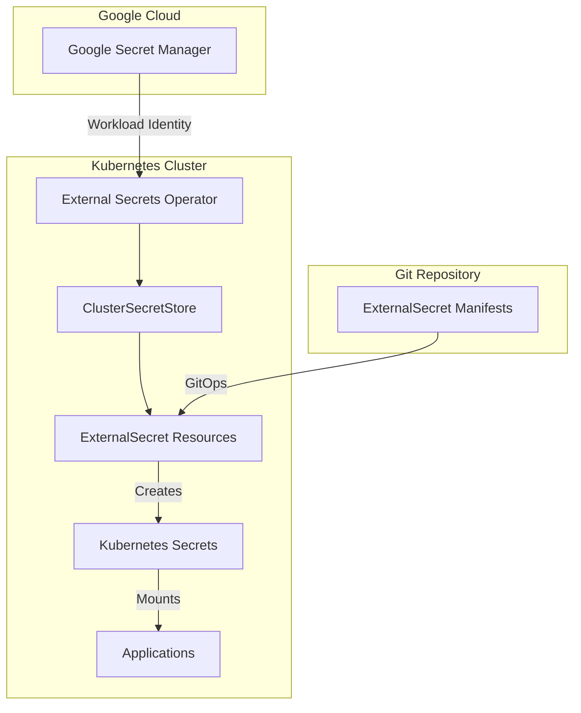

# External Secrets Management Guide

## Overview

This guide documents how secrets are managed in the GKE ArgoCD GitOps platform using External Secrets Operator (ESO) and Google Secret Manager. All sensitive data is stored securely in Google Secret Manager and synchronized to Kubernetes via ExternalSecrets.

**Key Benefits**:
- ✅ **Security**: Secrets never stored in Git
- ✅ **Rotation**: Automatic secret refresh and rotation
- ✅ **Audit**: Complete audit trail in Google Cloud
- ✅ **GitOps**: Declarative secret references
- ✅ **Consistency**: Single source of truth

## Architecture



## Prerequisites

### 1. Enable Google Secret Manager API
```bash
gcloud services enable secretmanager.googleapis.com --project=billingfinance-argocd
```

### 2. External Secrets Operator Installation
The operator is automatically installed via ArgoCD ApplicationSet at:
`infrastructure/services/external-secrets/`

### 3. Service Account Setup
The External Secrets service account is created by Terraform with appropriate permissions:
```bash
# Service account created by Terraform
external-secrets@billingfinance-argocd.iam.gserviceaccount.com

# Required role
roles/secretmanager.secretAccessor
```

## Secret Structure in Google Secret Manager

### Naming Convention
```
<service>/<secret-type>

Examples:
- argocd/oauth-client-secret
- grafana/oauth-client-id
- github/runners-personal-access-token
```

### Directory Structure
```
gke-argocd-secrets/
├── argocd/
│   ├── oauth-client-id
│   └── oauth-client-secret
├── grafana/
│   ├── oauth-client-id
│   └── oauth-client-secret
├── github/
│   └── runners-personal-access-token
├── alerting/
│   └── deadmanssnitch-webhook-url
└── notifications/
    └── teams-webhook-url
```

## Creating Secrets in Google Secret Manager

### Using gcloud CLI

#### OAuth Secrets
```bash
# ArgoCD OAuth
echo -n "921709141427-m034hqvmfqd63ai9i9nm8nojor0pbhdc.apps.googleusercontent.com" | \
  gcloud secrets create argocd/oauth-client-id --data-file=- --project=billingfinance-argocd

echo -n "GOCSPX-your-oauth-secret" | \
  gcloud secrets create argocd/oauth-client-secret --data-file=- --project=billingfinance-argocd

# Grafana OAuth (same OAuth app as ArgoCD)
echo -n "921709141427-m034hqvmfqd63ai9i9nm8nojor0pbhdc.apps.googleusercontent.com" | \
  gcloud secrets create grafana/oauth-client-id --data-file=- --project=billingfinance-argocd

echo -n "GOCSPX-your-oauth-secret" | \
  gcloud secrets create grafana/oauth-client-secret --data-file=- --project=billingfinance-argocd
```

#### Service Tokens
```bash
# GitHub Personal Access Token
echo -n "ghp_your_github_token" | \
  gcloud secrets create github/runners-personal-access-token --data-file=- --project=billingfinance-argocd

# Dead Man's Switch Webhook
echo -n "https://nosnch.in/your-snitch-token" | \
  gcloud secrets create alerting/deadmanssnitch-webhook-url --data-file=- --project=billingfinance-argocd

# Teams Webhook (if re-enabling notifications)
echo -n "https://teams-webhook-url" | \
  gcloud secrets create notifications/teams-webhook-url --data-file=- --project=billingfinance-argocd
```

### Using Google Cloud Console
1. Navigate to [Secret Manager](https://console.cloud.google.com/security/secret-manager)
2. Click "Create Secret"
3. Use the naming convention: `service/secret-type`
4. Add secret value
5. Keep default replication policy
6. Click "Create"

## ExternalSecret Configuration

### Location
All ExternalSecret resources are located in:
`infrastructure/external-secrets-config/`

### Deployed Secrets

| Secret Name | Namespace | GSM Path | Refresh Interval | Notes |
|------------|-----------|----------|------------------|-------|
| argocd-secret | argocd | argocd/oauth-client-secret | 1h | OAuth client secret only |
| grafana-oauth-secret | monitoring | grafana/oauth-* | 1h | Only client ID/secret; other config in values.yaml |
| github-runners-pat | github-runners | github/runners-personal-access-token | 24h | GitHub Personal Access Token |
| alertmanager-webhook-urls | monitoring | alerting/deadmanssnitch-webhook-url | 1h | Dead Man's Switch webhook |
| argocd-notifications-secret | argocd | notifications/teams-webhook-url | 1h | Teams webhook URL |

### Example ExternalSecret
```yaml
apiVersion: external-secrets.io/v1beta1
kind: ExternalSecret
metadata:
  name: app-secret-external
  namespace: my-app
spec:
  refreshInterval: 1h
  secretStoreRef:
    name: google-secret-manager
    kind: ClusterSecretStore
  target:
    name: app-secret
    creationPolicy: Owner
  data:
  - secretKey: api-key
    remoteRef:
      key: my-app/api-key
```

## Secret Rotation

### Automatic Rotation
1. Update secret value in Google Secret Manager
2. ExternalSecret refreshes based on `refreshInterval`
3. Applications automatically pick up new values (may require pod restart)

### Manual Rotation
```bash
# Force refresh by annotating ExternalSecret
kubectl annotate externalsecret <name> -n <namespace> \
  force-sync=$(date +%s) --overwrite

# Verify new secret value
kubectl get secret <secret-name> -n <namespace> -o jsonpath='{.data.<key>}' | base64 -d
```

## Monitoring and Troubleshooting

### Check ExternalSecret Status
```bash
# List all ExternalSecrets
kubectl get externalsecrets -A

# Check specific ExternalSecret status
kubectl describe externalsecret <name> -n <namespace>

# Common status conditions:
# - SecretSynced: Secret successfully synchronized
# - SecretSyncedError: Error syncing secret
```

### Common Issues

#### 1. Permission Denied
```bash
# Check workload identity binding
kubectl describe sa external-secrets -n external-secrets

# Verify GCP permissions
gcloud projects get-iam-policy billingfinance-argocd \
  --flatten="bindings[].members" \
  --filter="bindings.members:serviceAccount:external-secrets@*"
```

#### 2. Secret Not Found
```bash
# List secrets in GSM
gcloud secrets list --project=billingfinance-argocd

# Check secret exists
gcloud secrets describe <secret-name> --project=billingfinance-argocd
```

#### 3. Sync Failures
```bash
# Check operator logs
kubectl logs -n external-secrets deployment/external-secrets -f

# Check events
kubectl events -n <namespace> --for=externalsecret/<name>
```

#### 4. ArgoCD Applications Going OutOfSync Hourly

**Problem**: External Secrets cause ArgoCD applications to report OutOfSync status every hour when secrets refresh.

**Cause**: External Secrets Operator adds a `reconcile.external-secrets.io/data-hash` annotation to managed secrets that changes on every refresh cycle (default: 1 hour). ArgoCD detects this as a drift from desired state.

**Solution**: Configure ArgoCD to ignore these annotation changes using `ignoreDifferences`:

```yaml
# In ArgoCD Application or ApplicationSet spec
spec:
  ignoreDifferences:
  - group: ""
    kind: Secret
    name: <secret-name>  # e.g., argocd-secret, grafana-oauth-secret
    jsonPointers:
    - /data                      # Ignore data changes
    - /metadata/resourceVersion  # Ignore K8s resource version
    - /metadata/annotations      # Ignore ALL annotations (including data-hash)
```

**Important Notes**:
- ⚠️ Never use `/metadata/managedFields` - ArgoCD doesn't support it (causes sync errors)
- The `/metadata/annotations` path ignores ALL annotations, so specific annotation ignores are redundant
- After updating ignoreDifferences, refresh the ApplicationSet to apply changes

**Verification**:
```bash
# Check if fix is working - secret should refresh without causing OutOfSync
kubectl annotate externalsecret <name> -n <namespace> force-sync=$(date +%s) --overwrite
sleep 20
kubectl get application <app-name> -n argocd -o jsonpath='{.status.sync.status}'
# Should output: Synced
```

## Security Best Practices

### 1. Least Privilege Access
- External Secrets SA only has `secretAccessor` role
- Secrets are scoped to specific namespaces
- Use separate GSM projects for environments

### 2. Separation of Concerns
- **Only store sensitive values in secrets** (passwords, tokens, client secrets)
- **Keep configuration in GitOps** (URLs, domains, feature flags)
- Example: Grafana OAuth only stores client ID/secret; all other config in values.yaml
- Benefits: Easier config updates, better GitOps practices, cleaner secret management

### 3. Secret Hygiene
- Regular rotation schedule
- Strong secret values
- Audit access logs
- Never commit secrets to Git

### 4. Monitoring
```bash
# Enable audit logs for Secret Manager
gcloud logging read "resource.type=secretmanager.googleapis.com" \
  --project=billingfinance-argocd \
  --limit=50

# Set up alerts for failed access
```

### 5. Emergency Procedures
```bash
# Disable compromised secret
gcloud secrets versions disable latest \
  --secret=<secret-name> \
  --project=billingfinance-argocd

# Create new version
echo -n "new-secret-value" | gcloud secrets versions add <secret-name> \
  --data-file=- --project=billingfinance-argocd
```

## Adding New Secrets

### Step 1: Create Secret in GSM
```bash
echo -n "secret-value" | gcloud secrets create <service>/<secret-type> \
  --data-file=- --project=billingfinance-argocd
```

### Step 2: Create ExternalSecret Manifest
```yaml
# infrastructure/external-secrets-config/new-secret.yaml
apiVersion: external-secrets.io/v1beta1
kind: ExternalSecret
metadata:
  name: new-secret-external
  namespace: target-namespace
spec:
  refreshInterval: 1h
  secretStoreRef:
    name: google-secret-manager
    kind: ClusterSecretStore
  target:
    name: new-secret
    creationPolicy: Owner
  data:
  - secretKey: key-name
    remoteRef:
      key: service/secret-type
```

### Step 3: Update Kustomization
```yaml
# infrastructure/external-secrets-config/kustomization.yaml
resources:
  - existing-secrets.yaml
  - new-secret.yaml  # Add this line
```

### Step 4: Deploy via GitOps
```bash
git add infrastructure/external-secrets-config/new-secret.yaml
git add infrastructure/external-secrets-config/kustomization.yaml
git commit -m "Add ExternalSecret for new-secret"
git push
```

## Disaster Recovery

### Backup Secrets
```bash
# Export all secrets from GSM
for secret in $(gcloud secrets list --project=billingfinance-argocd --format="value(name)"); do
  echo "Backing up $secret"
  gcloud secrets versions access latest --secret=$secret \
    --project=billingfinance-argocd > "backup/$secret.txt"
done
```

### Restore Secrets
```bash
# Restore from backup
for file in backup/*.txt; do
  secret_name=$(basename $file .txt)
  gcloud secrets create $secret_name --data-file=$file \
    --project=billingfinance-argocd
done
```

## Related Documentation

- [External Secrets Operator Documentation](https://external-secrets.io/)
- [Google Secret Manager Documentation](https://cloud.google.com/secret-manager/docs)
- [Infrastructure External Secrets Config](../infrastructure/external-secrets-config/CLAUDE.md)
- [OAuth Secret Management](OAUTH-SECRET-MANAGEMENT.md)

---

*External Secrets provide a secure, auditable, and GitOps-friendly approach to secret management, ensuring sensitive data never resides in Git repositories while maintaining declarative configuration.*
